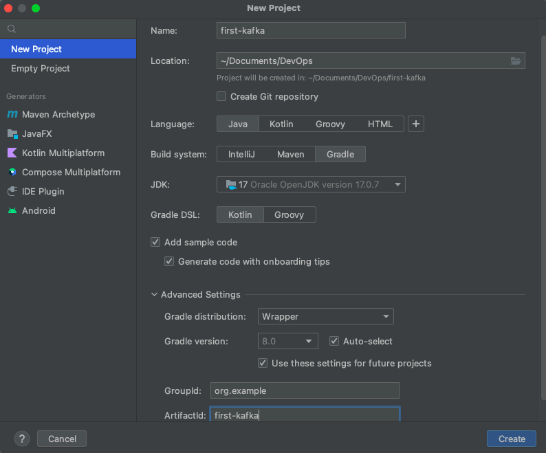
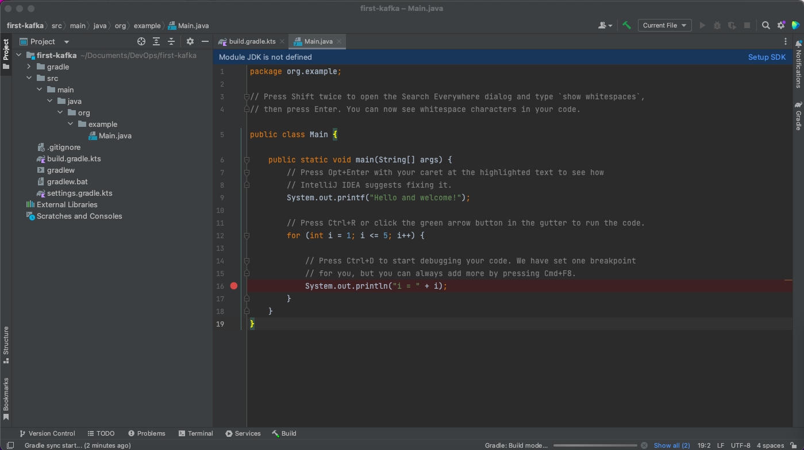
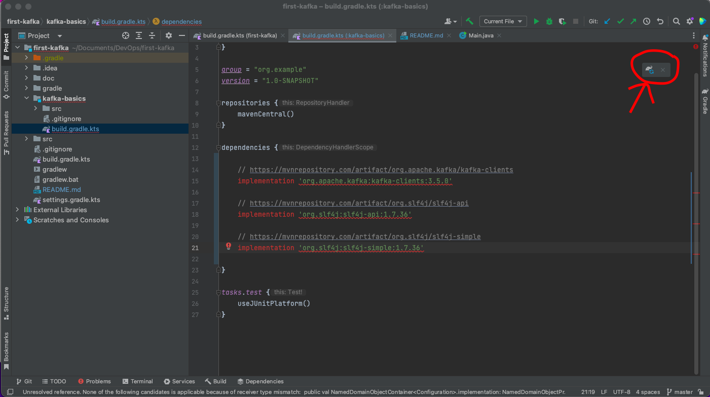
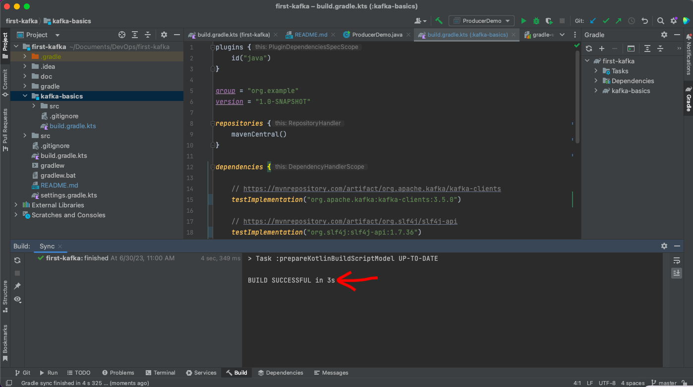
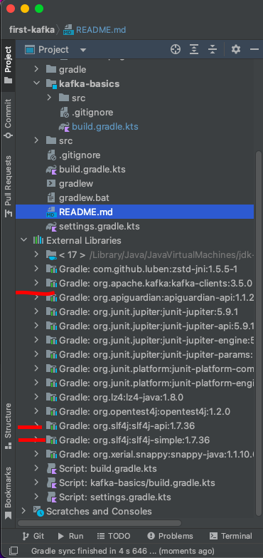

# kakfa-java-programming
A simple Java project using Gradle that can interact with Kafka cluster, developing Kafka producers and consumers in Java.

## Prerequisites;
- Download and installed IDE, preferably IntelliJ Community IDEA
- Get Java JDK installed. I will be using version 17.0.7 and Gradle to set up the project.

## Steps
- Step 1; Project file creation
- In IntelliJ IDEA, create a new Java Gradle project (File > New > Project); first-kafka > Location; [choose-a-path] > Language; Java > Build System; Gradle > JDK; version 17.0.7 > I keep all the default ‘Advanced Setting’. This will create a new project. While it will take some time for gradle to sync. 

- Step 2; Project Organization
- 1.) create sub-project; select and delete the src directory, right click on the first-kafka directory > choose ‘’’New’’’ > ‘’’Module’’’ > Pick Gradle, Java and version 17.0.7, Name; kafka-basics, Advance Settings remain the same.  The new module will automatically be populate with src directory, .gitignore and build.gradle.kts. Disregard the newly created src directory at the root of this project.
- 2.) add Kafka dependencies; Define the Kafka Dependencies in the dependencies { ... } block.
  By visit this site; https://mvnrepository.com/artifact/org.apache.kafka
Choose kafka-clients, latest version(3.5.0), Gradle short and copy the entire text and paste in the dependencies block.
From the above website, search for slf4j api(i choose 1.7.36) and paste in the dependencies block as well.
Again, from the above website, search for slf4j simple for login(choose the same version - 1.7.36) and paste in the dependencies block as well. Make sure the three dep. are implementation and not testImplementation.

Load the Gradle changes with the menu from the right hand side to import all the dependencies as external libraries.

Now have all the required libraries, check the external libraries in the root of the project to confirm this, if not there kindly reload.

- 
- Step 3; Create a java package
- While creating the java package, follow the package naming conventions.
- create java package; from kafka-basics directory > src > main > Java > choose ‘’’New’’’ > ‘’’Java Class’’ > Name; org.basics.demos.kafka.ProducerDemo, Advance Settings remain the same.  The new module will automatically be populate with src directory, .gitignore and build.gradle.kts. Disregard the newly created src directory at the root of this project.
